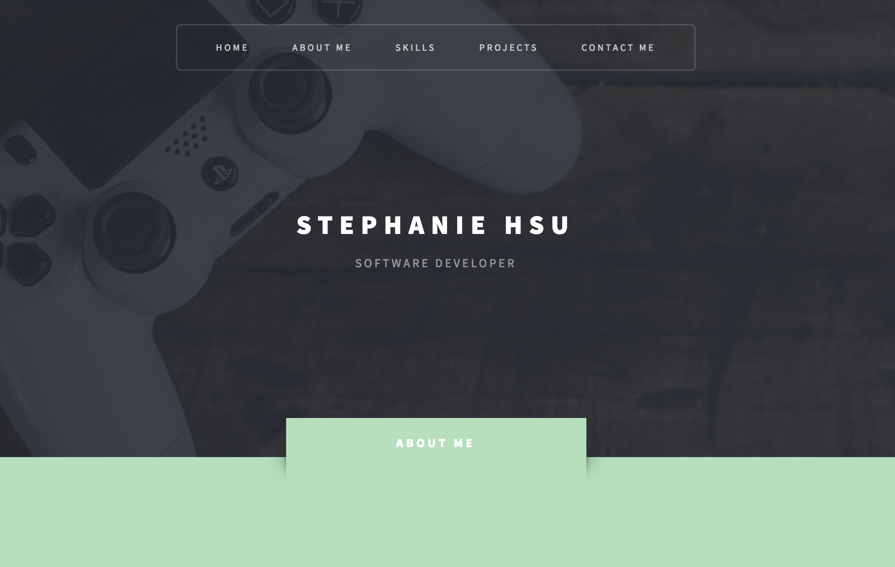
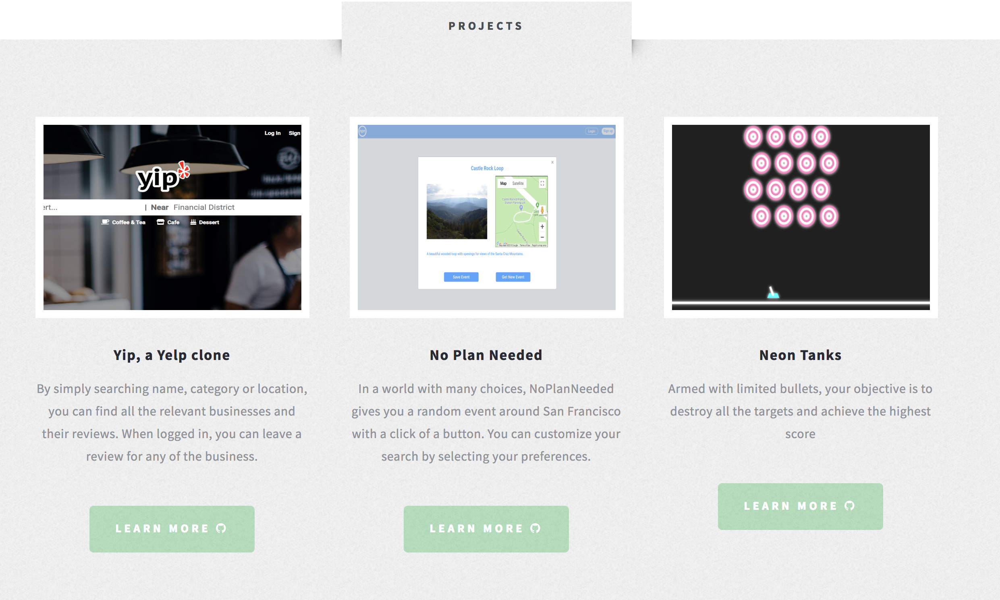

# Welcome to my portfolio
## You can review a [live](https://hsusteph5.github.io/portfolio/) demo here!

### Excerpt from the portfolio
```
As a life-long avid gamer and lover of all things gaming, I decided to
switch careers from education to software engineer. Streaming on Twitch was one of 
catalysts that challenged me to rise out of my comfort-zone, become a content-creator, and 
simply enjoy creating... 
```


<!--  -->


#### Credits:
	* Original template is: Escape Velocity by HTML5 UP
		* html5up.net | @ajlkn
		* Free for personal and commercial use under the CCA 3.0 license (html5up.net/license)

	* Demo Images:
		* Felicia Simion (ineedchemicalx.deviantart.com)

	* Icons:
		* Font Awesome (fontawesome.io)

	* Other:
		* jQuery (jquery.com)
		* Responsive Tools (github.com/ajlkn/responsive-tools)
		* AJ aj@lkn.io | @ajlkn
